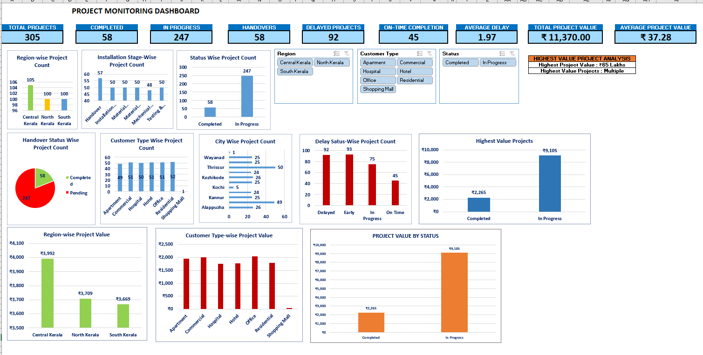

# Elevator Project Monitoring Dashboard

An interactive Excel dashboard developed for monitoring elevator installation projects, project status, delays, handovers, and project value.

## 📊 Dashboard Preview

## 📄 Case Study

[View the Complete Case Study (PDF)](Elevator_Project_Monitoring_Case_Study.pdf)

## 🔍 Project Overview

This dashboard provides a centralized view of elevator installation project performance and helps monitor key project metrics through interactive charts, KPI cards, and slicers.

## 📌 Key KPIs

- Total Projects: 305
- Completed Projects: 58
- Projects In Progress: 247
- Handovers: 58
- Delayed Projects: 92
- On-Time Completion: 45
- Average Delay: 1.97
- Total Project Value: ₹11,370.00
- Average Project Value: ₹37.28

## 📈 Dashboard Analysis

The dashboard includes:

- Region-wise Project Count
- Installation Stage-wise Project Count
- Status-wise Project Count
- Handover Status Analysis
- Customer Type-wise Project Count
- City-wise Project Count
- Delay Status-wise Project Count
- Highest Value Projects
- Region-wise Project Value
- Customer Type-wise Project Value
- Project Value by Status

## 🎛️ Interactive Filters

The dashboard includes interactive slicers for:

- Region
- Customer Type
- Status

These filters allow users to dynamically analyze project information.

## 🛠️ Tools & Technologies

- Microsoft Excel
- Pivot Tables
- Pivot Charts
- Slicers
- Excel Dashboard Design
- Data Analysis
- Data Visualization

## 💡 Key Highlights

- Centralized project monitoring dashboard
- Interactive filtering using Excel slicers
- KPI-based project performance monitoring
- Visual analysis of project delays and status
- Project value analysis across regions and customer types
- Professional dashboard layout for management reporting

## 📁 Files

- `Elevator_Project_Monitoring_Dashboard_V1.xlsx` — Interactive Excel dashboard
- `Dashboard-Screenshot.png` — Dashboard preview
- - Elevator_Project_Monitoring_Case_Study.pdf — Detailed project case study

## 👤 Author

**Denisha Denny**
